# KILIE IMMO — Architecture SaaS de Gestion Immobilière
## Côte d'Ivoire & Afrique de l'Ouest
### Document d'Architecture Technique — v1.0 — Juin 2026

---

## RÉSUMÉ EXÉCUTIF

KILIE IMMO est une plateforme SaaS B2B multi-tenant de gestion immobilière conçue pour le marché ivoirien et ouest-africain. L'architecture retenue est un **Monolithe Modulaire** organisé autour de **12 Bounded Contexts** distincts, appliquant les principes **DDD (Domain-Driven Design)**, **Architecture Hexagonale (Ports & Adapters)**, et **Event-Driven Architecture** pour assurer la séparation des préoccupations et permettre une extraction progressive vers les microservices.

La spécificité africaine impose : Mobile Money comme canal de paiement principal (MTN MoMo, Orange Money, Wave via CinetPay), architecture PWA mobile-first, gestion de la complexité foncière ivoirienne (Titre Foncier, ACD, AV), et devise XOF.

---

## 1. ANALYSE DU BESOIN

### 1.1 Contexte Marché — Côte d'Ivoire

| Indicateur | Valeur |
|---|---|
| Population Abidjan | ~6 millions d'habitants |
| Croissance urbaine annuelle | ~4% |
| Pénétration Mobile Money | 85% des adultes |
| Bancarisation | 30–40% de la population |
| Internet (mobile-first) | 90%+ via smartphone |
| Devise | XOF / FCFA (valeur entière) |
| TVA loyers commerciaux | 18% |

**Tensions du marché :**
- Gestion immobilière encore très manuelle (cahiers, espèces, SMS informels)
- Forte diaspora investissant à distance (France, USA, Gabon) sans visibilité
- Croissance du parc locatif formel non accompagnée d'outils professionnels
- Complexité foncière : coexistence Titre Foncier, ACD, ACP, Attestation Villageoise
- Absence d'outils de scoring locataire et de scoring solvabilité

### 1.2 Acteurs du Système (Personas)

| Acteur | Type | Rôle Métier |
|---|---|---|
| Agence Immobilière | Tenant SaaS principal | Gestion mandats, portefeuille clients, commissions |
| Propriétaire Bailleur | Utilisateur portail | Suivi patrimoine, revenus, décisions |
| Gestionnaire de Patrimoine | Utilisateur interne | Multi-propriétaires, procurations, consolidation |
| Locataire | Utilisateur portail | Paiements, documents, demandes, communication |
| Acheteur | Utilisateur portail vente | Recherche, visites, suivi offres |
| Syndic de Copropriété | Tenant SaaS | Charges, travaux, assemblées générales |
| Comptable | Utilisateur interne | Rapprochement, TVA, déclarations fiscales |
| Prestataire Maintenance | Utilisateur externe limité | Réception ordres, devis, facturation |
| Administrateur SaaS | Opérateur plateforme | Onboarding tenants, facturation, support |

### 1.3 Contraintes Spécifiques Côte d'Ivoire

1. **Mobile Money obligatoire** : MTN MoMo, Orange Money, Wave, Moov Money via agrégateur CinetPay
2. **Devise XOF** : entiers, règles d'arrondi UEMOA
3. **Fiscalité** : TVA 18% (baux commerciaux), Contribution Foncière, retenue à la source (20%)
4. **Documents fonciers** : Titre Foncier (TF), ACD, ACP, Attestation Villageoise, Permis de Construire
5. **Baux** : bail d'habitation vs bail commercial — régimes légaux différents
6. **Adressage** : commune / quartier / ilot / GPS (pas toujours de numéro de rue)
7. **Connectivité instable** : PWA offline-capable, chargement progressif
8. **Conformité** : Loi n° 2013-450 sur la protection des données personnelles (CI)
9. **Langue** : Français obligatoire, interface RTL non requise

### 1.4 Besoins Fonctionnels par Phase

**Phase 1 — MVP :**
- Catalogue biens (photos, GPS, caractéristiques, statut)
- Gestion parties prenantes (locataires, propriétaires, KYC)
- Cycle de vie des baux (création → signature → activation → résiliation)
- Collecte loyers Mobile Money + quittancement automatique
- Gestion documentaire (contrats, quittances, états des lieux)
- Tableaux de bord agence & propriétaire
- Notifications multi-canaux (SMS, email, WhatsApp)
- Multi-tenant avec contrôle des accès par rôle

**Phase 2 :**
- Module vente immobilière (pipeline, compromis, acte)
- Gestion de copropriété (tantièmes, charges, AG)
- Portail locataire (self-service)
- Gestion maintenance et ordres d'intervention
- Comptabilité avancée et reporting fiscal ivoirien
- Application mobile native

**Phase 3 — Strategic :**
- Marketplace d'annonces immobilières
- Score de solvabilité locataire (IA)
- Tarification dynamique (IA)
- API publique partenaires (notaires, banques, cadastre DGF)

### 1.5 Exigences Non-Fonctionnelles (NFR)

| NFR | Cible |
|---|---|
| Disponibilité | 99.9% — SLA (< 8.7h d'indisponibilité/an) |
| Latence API | < 500ms P95 depuis Abidjan |
| Throughput | 500 req/s en charge nominale |
| Scalabilité horizontale | 10 000 biens, 100 000 utilisateurs / tenant |
| Sécurité | OWASP Top 10, TLS 1.3, chiffrement AES-256 at-rest |
| Mobile Performance | Lighthouse PWA > 90, First Contentful Paint < 3s (3G) |
| Multi-tenancy | Isolation data stricte par organisation |
| Audit Trail | Immuable — toutes opérations métier |
| RTO | < 4 heures |
| RPO | < 1 heure |

---

## 2. MODULES IDENTIFIÉS (15 modules)

| # | Module | Responsabilité | Domaine | Phase |
|---|---|---|---|---|
| 1 | **Property** | Catalogue, caractéristiques, statut, localisation | Core | MVP |
| 2 | **Party** | Personnes physiques/morales, KYC, dossiers | Core | MVP |
| 3 | **Leasing** | Baux, échéanciers, révisions, états des lieux | Core | MVP |
| 4 | **Financial** | Appels de fonds, paiements, quittances, comptabilité | Core | MVP |
| 5 | **Document** | GED, génération PDF, signature électronique | Supporting | MVP |
| 6 | **Notification** | SMS, email, WhatsApp, push, planification | Supporting | MVP |
| 7 | **IAM** | Utilisateurs, rôles, organisations, MFA | Generic | MVP |
| 8 | **Subscription** | Plans SaaS, facturation, limites d'usage | Generic | MVP |
| 9 | **Integration** | Adaptateurs CinetPay, SMS, email, cadastre | Generic | MVP |
| 10 | **Maintenance** | Ordres d'intervention, devis, prestataires | Supporting | V2 |
| 11 | **Sales** | Pipeline vente, offres, compromis, actes | Core | V2 |
| 12 | **Condominium** | Copropriété, tantièmes, charges, AG | Supporting | V2 |
| 13 | **TenantPortal** | Self-service locataire | Supporting | V2 |
| 14 | **OwnerPortal** | Self-service propriétaire | Supporting | V2 |
| 15 | **Analytics** | Reporting BI, tableaux de bord, export | Generic | V2 |

---

## 3. BOUNDED CONTEXTS (DDD)

### 3.1 Context Map

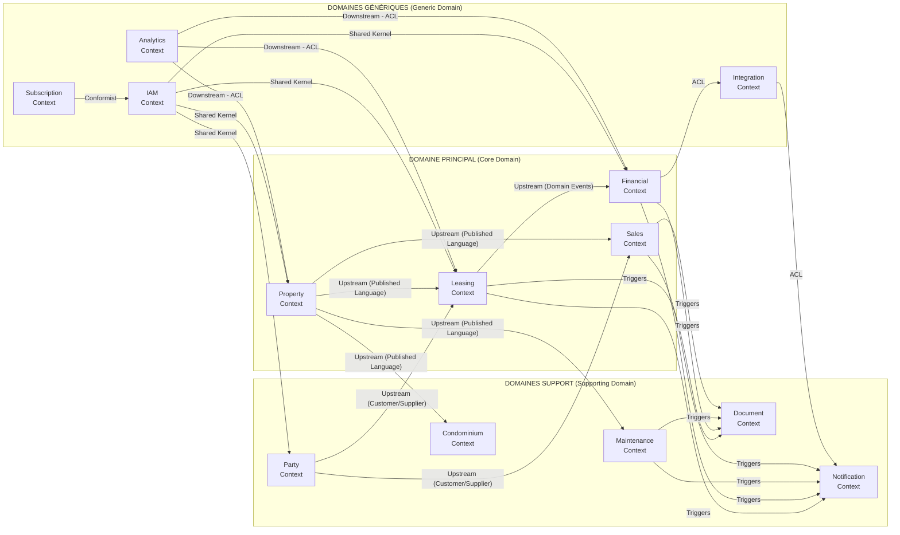

### 3.2 Relations entre Contextes

| Relation | Contexte Upstream | Contexte Downstream | Type |
|---|---|---|---|
| Property → Leasing | Property | Leasing | Published Language |
| Property → Sales | Property | Sales | Published Language |
| Party → Leasing | Party | Leasing | Customer/Supplier |
| Leasing → Financial | Leasing | Financial | Domain Events |
| Leasing → Document | Leasing | Document | Domain Events |
| Financial → Integration | Financial | Integration (CinetPay) | ACL |
| IAM → All | IAM | Tous | Shared Kernel |
| Analytics → Core | Core Domains | Analytics | ACL (Read Model) |

**Légende des relations :**
- **Published Language** : Contrat API explicite, stable
- **Customer/Supplier** : Négociation entre équipes
- **ACL (Anti-Corruption Layer)** : Traduction de modèles entre contextes
- **Shared Kernel** : Code partagé, évolue consensuellement
- **Domain Events** : Communication asynchrone par événements

---

## 4. DOMAINES MÉTIER

### 4.1 Classification Strategic (Wardley / DDD)

```
┌─────────────────────────────────────────────────────────────────┐
│                    STRATEGIC DESIGN                              │
├──────────────────┬──────────────────────┬───────────────────────┤
│   CORE DOMAIN    │  SUPPORTING DOMAIN   │   GENERIC DOMAIN      │
│  (Avantage       │  (Différenciateur    │  (Commodité —         │
│   Concurrentiel) │   secondaire)        │   Build or Buy)       │
├──────────────────┼──────────────────────┼───────────────────────┤
│ • Property       │ • Party (KYC CI)     │ • IAM                 │
│ • Leasing        │ • Maintenance        │ • Subscription        │
│ • Financial      │ • Condominium        │ • Analytics           │
│ • Sales          │ • Document           │ • Notification        │
│                  │ • TenantPortal       │ • Integration         │
│                  │ • OwnerPortal        │                       │
├──────────────────┼──────────────────────┼───────────────────────┤
│  → Développer    │  → Développer avec   │  → Acheter ou Open    │
│    en interne    │    soin              │    Source (Keycloak,  │
│    (DDD complet) │    (DDD léger)       │    Stripe, etc.)      │
└──────────────────┴──────────────────────┴───────────────────────┘
```

### 4.2 Ubiquitous Language par Domaine

| Terme Métier | Contexte | Définition CI |
|---|---|---|
| **Bien** | Property | Actif immobilier (villa, appart, local commercial, terrain) |
| **Lot** | Property / Condo | Unité dans un immeuble en copropriété |
| **Titre Foncier (TF)** | Property | Document officiel de propriété, délivré par la DGF |
| **Attestation Villageoise** | Property | Titre informel reconnu dans les zones villageoises |
| **Bail** | Leasing | Contrat de location (habitation ou commercial) |
| **Loyer** | Leasing / Financial | Montant mensuel dû par le locataire |
| **Dépôt de garantie** | Leasing | Caution versée à l'entrée (1–2 mois) |
| **Quittance** | Financial | Reçu officiel de paiement de loyer |
| **Appel de fonds** | Financial | Facturation périodique émise vers le locataire |
| **Régularisation** | Financial | Ajustement annuel des charges |
| **État des lieux** | Leasing | Inventaire contradictoire entrant/sortant |
| **Mandat** | Property / Sales | Autorisation donnée par propriétaire à agence |
| **Compromis** | Sales | Avant-contrat de vente |
| **Acte authentique** | Sales | Acte notarié définitif de vente |
| **Tantième** | Condominium | Quote-part de charges en copropriété |
| **OI** | Maintenance | Ordre d'Intervention |

---

## 5. AGRÉGATS DDD

### 5.1 Property Context — Agrégats

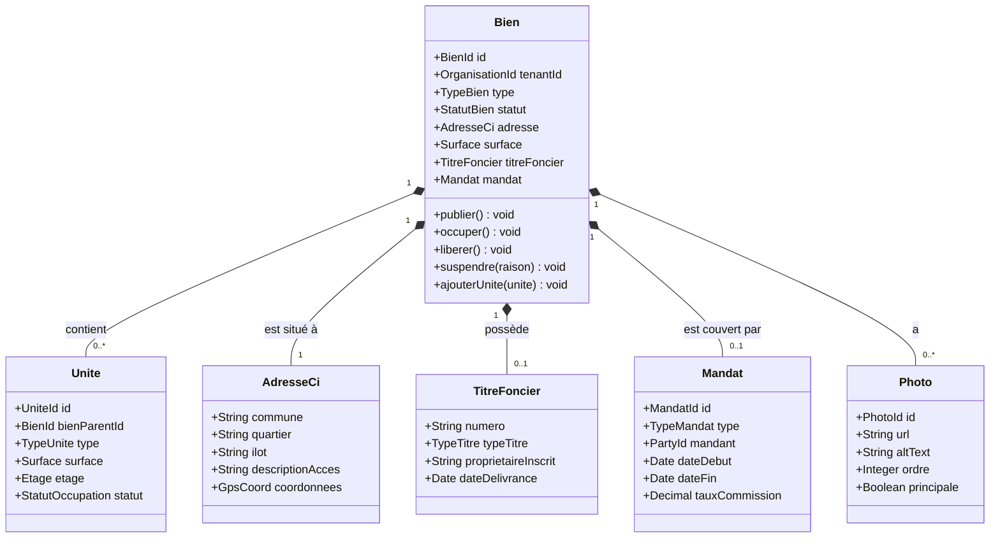

### 5.2 Leasing Context — Agrégats

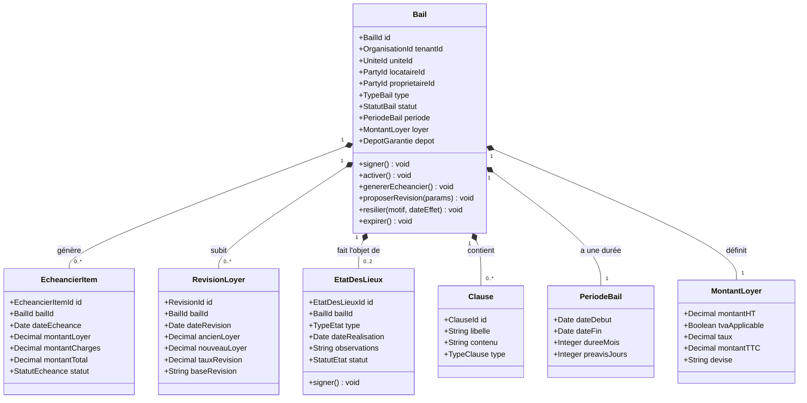

### 5.3 Financial Context — Agrégats

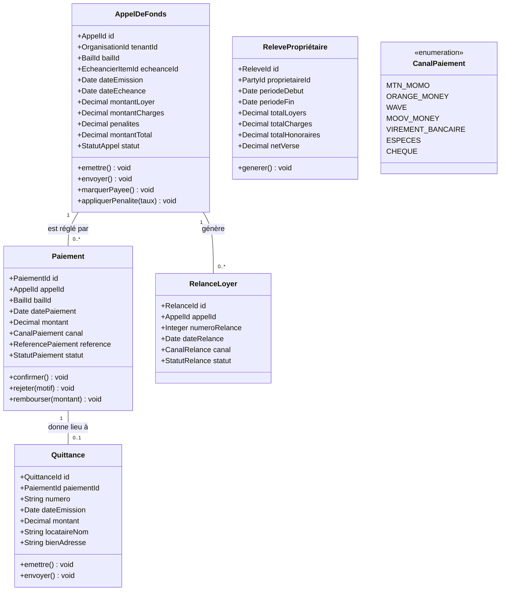

### 5.4 Party Context — Agrégats

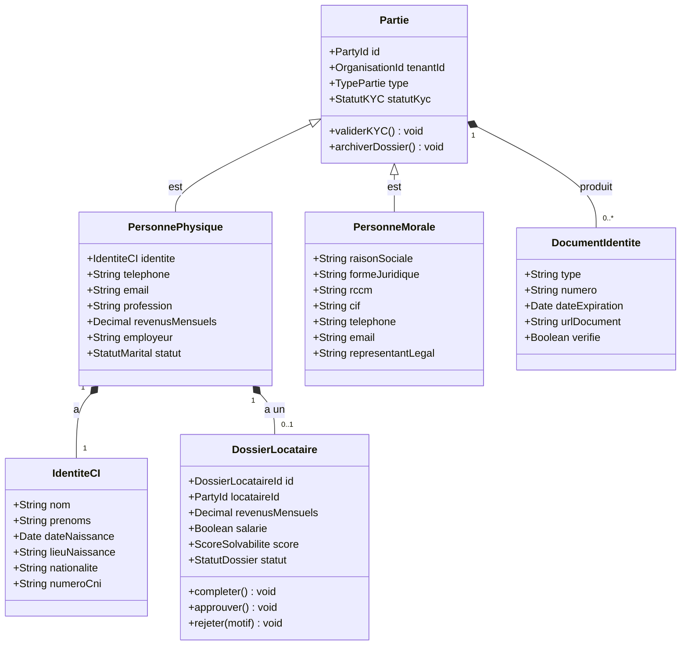

### 5.5 Maintenance Context — Agrégats

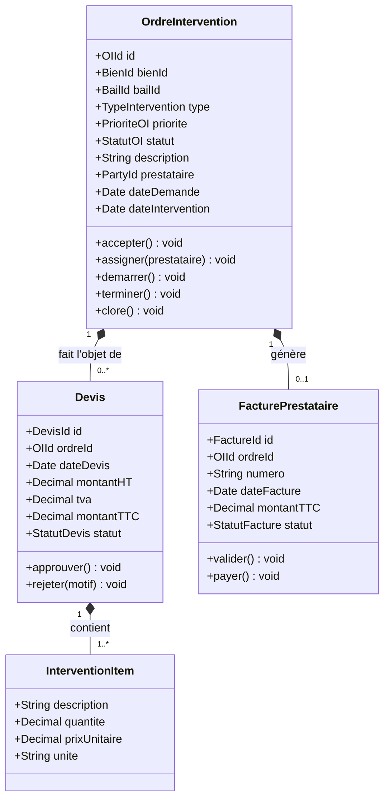

---

## 6. ENTITÉS MÉTIER

### 6.1 Vue Relationnelle des Entités Principales

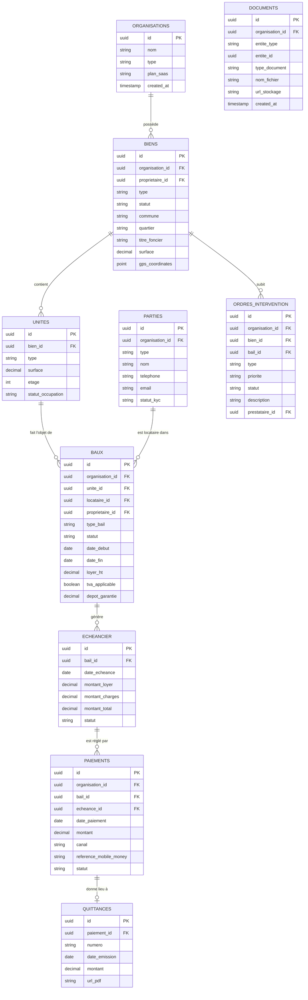

---

## 7. ÉVÉNEMENTS MÉTIER (Domain Events)

### 7.1 Property Context

| Événement | Déclencheur | Consommateurs |
|---|---|---|
| `BienCree` | Création bien | Analytics, Document |
| `BienPublie` | Mise en ligne | Notification, Sales |
| `BienOccupe` | Bail activé | Analytics |
| `BienLibere` | Bail résilié/expiré | Notification, Analytics |
| `BienSuspendu` | Décision gestionnaire | Notification |
| `PhotoBienTeleversee` | Upload photo | Document |
| `MandatCree` | Signature mandat | Document, Notification |

### 7.2 Party Context

| Événement | Déclencheur | Consommateurs |
|---|---|---|
| `PartieCreee` | Enregistrement | IAM, Notification |
| `DossierLocataireSoumis` | Candidature | Notification |
| `DossierLocataireApprouve` | Validation KYC | Leasing, Notification |
| `DossierLocataireRejete` | Refus KYC | Notification |
| `KYCVerifie` | Validation documents | Leasing, Financial |

### 7.3 Leasing Context

| Événement | Déclencheur | Consommateurs |
|---|---|---|
| `BailCree` | Création bail | Document, Notification |
| `BailSigne` | Signature parties | Document, Notification |
| `BailActive` | Date début atteinte | Property (occupe bien), Financial (génère échéancier) |
| `EcheancierGenere` | Activation bail | Financial, Notification |
| `BailRevisionAppliquee` | Avenant | Financial, Document, Notification |
| `BailPreavisGiven` | Préavis locataire/proprio | Notification, Analytics |
| `BailResilié` | Résiliation | Property (libère), Financial, Notification |
| `BailExpire` | Date fin | Property (libère), Financial, Notification |
| `DepotGarantieEncaisse` | Paiement dépôt | Financial |
| `DepotGarantieRestitue` | Restitution | Financial, Notification |
| `EtatDesLieuxSigne` | Signature contradictoire | Document, Notification |

### 7.4 Financial Context

| Événement | Déclencheur | Consommateurs |
|---|---|---|
| `AppelDeFondsCree` | Génération mensuelle | Notification |
| `AppelDeFondsEnvoye` | Distribution | Notification |
| `PaiementRecu` | Confirmation Mobile Money | Leasing, Notification, Document |
| `PaiementEnRetard` | Dépassement échéance | Notification |
| `RelanceSentG1` | J+3 retard | Notification |
| `RelanceSentG2` | J+10 retard | Notification |
| `RelanceSentG3` | J+15 retard | Notification, Legal |
| `QuittanceEmise` | Paiement confirmé | Document, Notification |
| `DepenseEnregistree` | Saisie charge | Analytics |
| `RelevePropriétaireGenere` | Mensuel/Trimestriel | Document, Notification |

### 7.5 Maintenance Context

| Événement | Déclencheur | Consommateurs |
|---|---|---|
| `OICreee` | Signalement | Notification |
| `OIAssignee` | Affectation prestataire | Notification |
| `OIDemarree` | Début intervention | Notification |
| `OITerminee` | Fin intervention | Notification, Financial |
| `DevisRecu` | Soumission devis | Notification |
| `DevisApprouve` | Validation | Notification, Financial |
| `FacturePrestaireValidee` | Validation facture | Financial |

### 7.6 Sales Context

| Événement | Déclencheur | Consommateurs |
|---|---|---|
| `BienMisEnVente` | Décision propriétaire | Property, Notification |
| `VisteePlanifiee` | Prise de RDV | Notification |
| `OffreDachatRecue` | Dépôt offre | Notification |
| `OffreDachatAcceptee` | Validation | Notification, Document |
| `CompromisSigné` | Signature | Document, Notification, Financial |
| `ActeAuthentiqueSigne` | Notarisation | Property (transfert), Financial, Document |
| `CommissionEarnee` | Acte signé | Financial |

---

## 8. WORKFLOWS

### 8.1 Workflow — Mise en Location d'un Bien

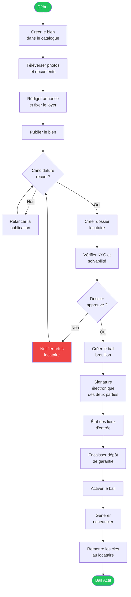

### 8.2 Workflow — Cycle de Vie d'un Bail (State Machine)

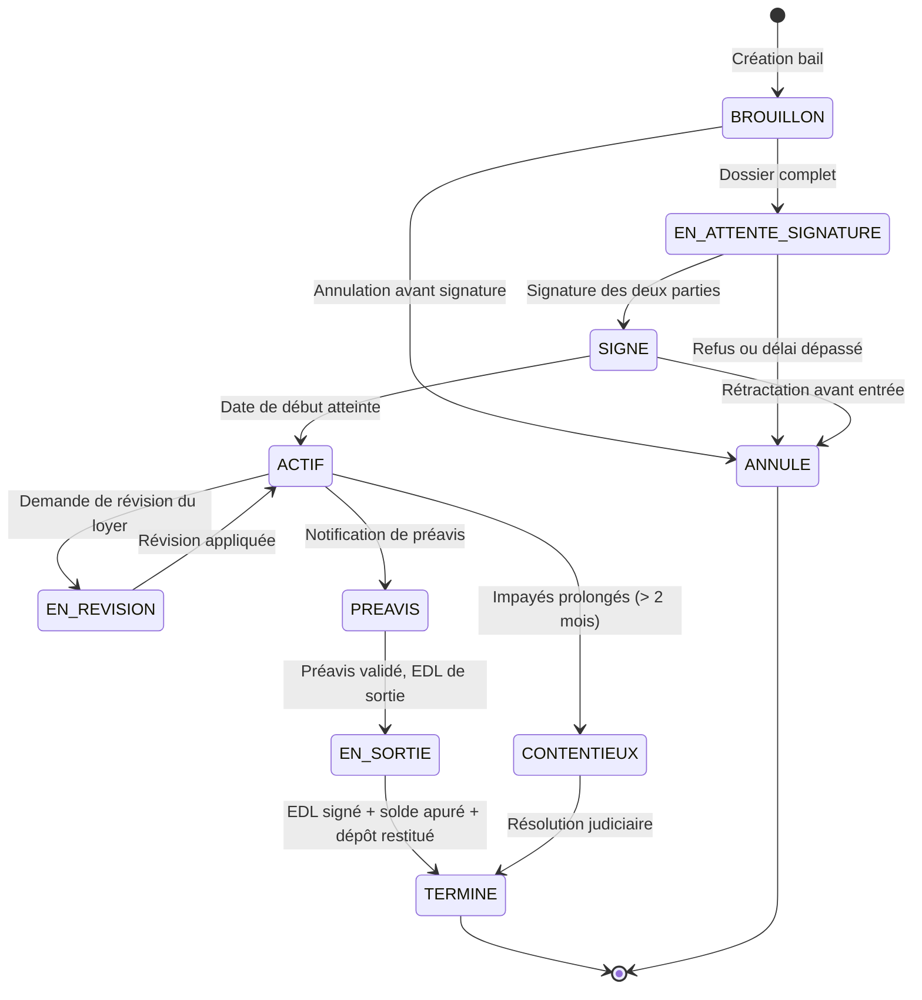

### 8.3 Workflow — Collecte de Loyer via Mobile Money

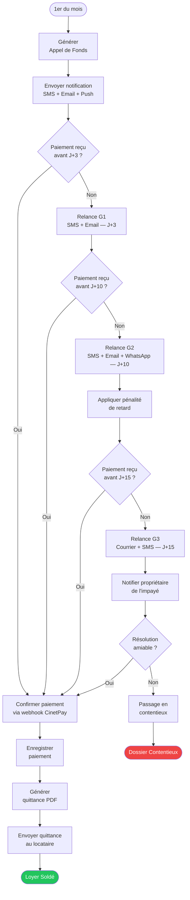

### 8.4 Workflow — Gestion d'un Ordre d'Intervention

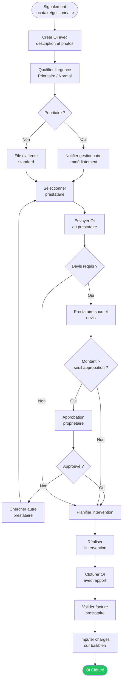

### 8.5 Workflow — Résiliation de Bail

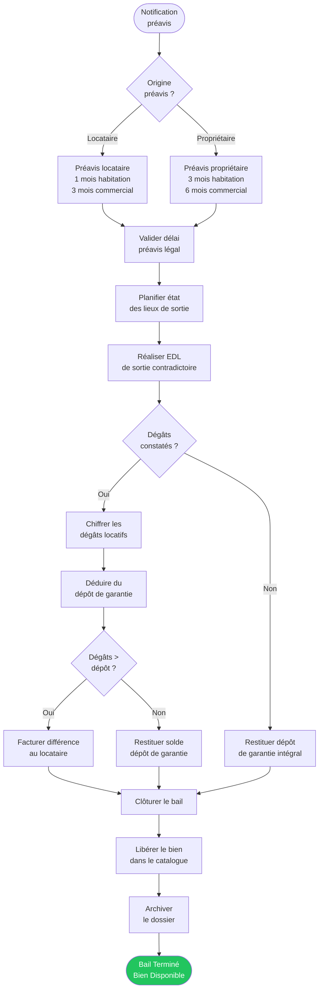

### 8.6 Workflow — Vente Immobilière

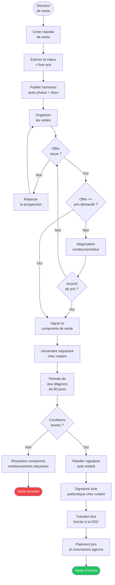

---

## 9. DÉPENDANCES ENTRE MODULES

### 9.1 Graphe de Dépendances

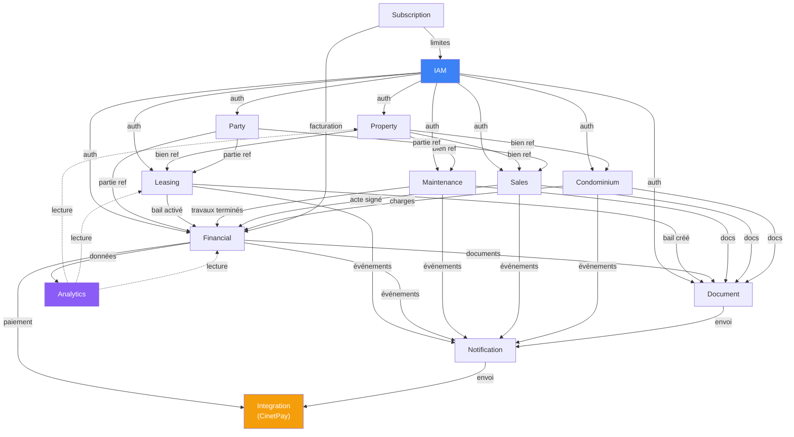

### 9.2 Matrice de Dépendances

| Module | Dépend de | Produit des événements vers |
|---|---|---|
| IAM | — | Tous les modules (auth) |
| Property | IAM | Leasing, Sales, Maintenance, Condominium |
| Party | IAM | Leasing, Sales, Financial |
| Leasing | Property, Party, IAM | Financial, Document, Notification |
| Financial | Leasing, Party, IAM | Notification, Document, Analytics, Integration |
| Maintenance | Property, Leasing, IAM | Financial, Notification, Document |
| Sales | Property, Party, IAM | Financial, Document, Notification |
| Condominium | Property, Financial, IAM | Financial, Notification, Document |
| Document | Tous les modules | Notification |
| Notification | Tous les modules | Integration (SMS/Email) |
| Integration | Financial, Notification | — (adaptateur externe) |
| Analytics | Property, Leasing, Financial | — (read-only) |
| Subscription | IAM | Financial |

---

## 10. ARCHITECTURE HEXAGONALE COMPLÈTE

### 10.1 Principe de l'Architecture Hexagonale (Ports & Adapters)

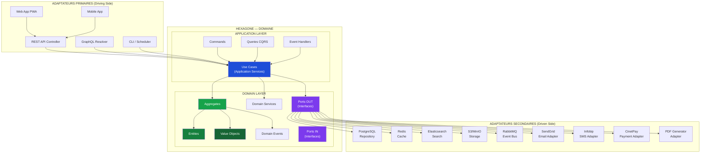

### 10.2 Architecture Hexagonale — Module Financial (Exemple Détaillé)

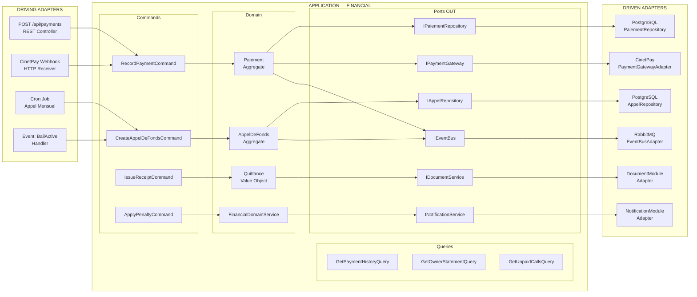

### 10.3 Structure du Monolithe Modulaire

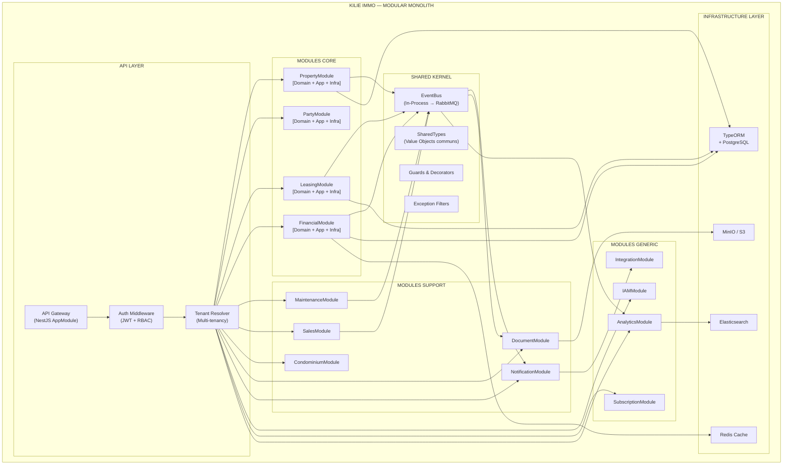

---

## DIAGRAMMES DE SÉQUENCE

### Séquence 1 — Création et Activation d'un Bail

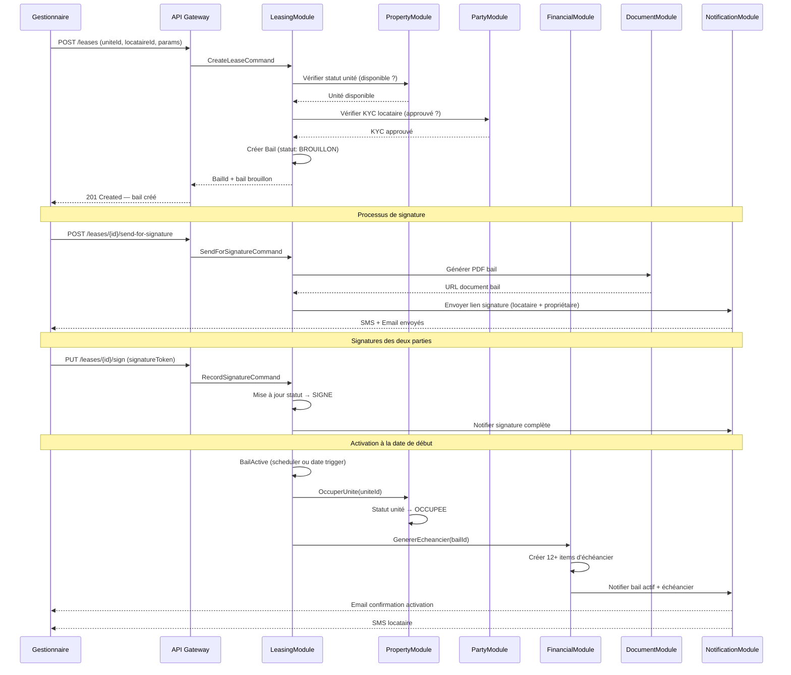

### Séquence 2 — Paiement de Loyer via Mobile Money

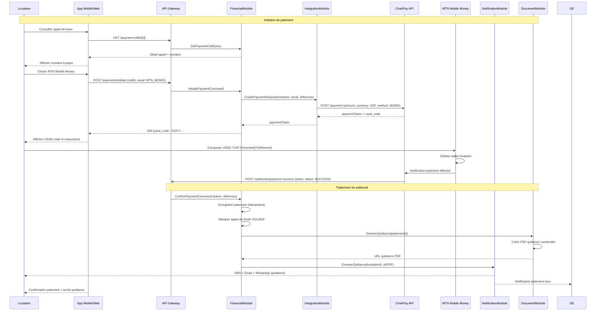

### Séquence 3 — Workflow de Maintenance

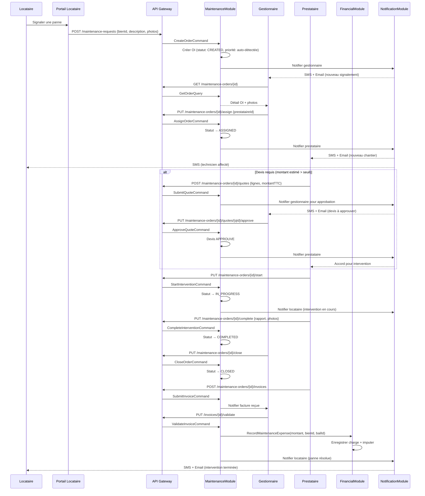

---

## DIAGRAMME DE DÉPLOIEMENT

### Architecture Infrastructure — Production

```mermaid
graph TB
    subgraph Internet["INTERNET / CDN"]
        CF["Cloudflare CDN\n(Cache + WAF + DDoS Protection)"]
        DNS["DNS — kilie-immo.ci"]
    end

    subgraph Users["UTILISATEURS"]
        WEB_USER["Web Browser\n(PWA)"]
        MOB_USER["Mobile App\n(iOS / Android)"]
        ADMIN_USER["Admin SaaS\n(Internal)"]
    end

    subgraph AWS_PARIS["AWS eu-west-3 (Paris) — Région Principale"]
        subgraph VPC["VPC Privé"]
            subgraph PUBLIC_SN["Subnets Publics (2 AZ)"]
                ALB["Application Load Balancer\n(HTTPS termination)"]
                NAT["NAT Gateway"]
            end

            subgraph PRIVATE_SN["Subnets Privés (2 AZ)"]
                subgraph EKS["EKS Cluster (Kubernetes)"]
                    API_PODS["API Pods\n(NestJS — x3 min)\nHPA auto-scaling"]
                    WORKER_PODS["Worker Pods\n(Jobs/Cron)\n(x2)"]
                    NOTIF_PODS["Notification Pods\n(x2)"]
                end

                subgraph RDS["Amazon RDS"]
                    PG_PRIMARY["PostgreSQL 15\nPrimary (r6g.large)"]
                    PG_REPLICA["PostgreSQL 15\nRead Replica"]
                end

                subgraph CACHE["ElastiCache"]
                    REDIS["Redis 7\n(Cluster Mode)"]
                end

                subgraph MQ["Amazon MQ"]
                    RABBIT["RabbitMQ\n(3-node cluster)"]
                end

                subgraph SEARCH["OpenSearch Service"]
                    ES["OpenSearch\n(Elasticsearch)"]
                end
            end

            S3["Amazon S3\n(Documents, Photos)"]
            SES["Amazon SES\n(Email)"]
        end
    end

    subgraph EXTERNAL["SERVICES EXTERNES"]
        CINETPAY["CinetPay API\n(Mobile Money CI)"]
        INFOBIP["Infobip\n(SMS — Afrique)"]
        DOCUSIGN["DocuSign / YouSign\n(Signature électronique)"]
        CF_R2["Cloudflare R2\n(CDN Assets)"]
    end

    subgraph DR["DR Region — AWS eu-west-1 (Irlande)"]
        DR_RDS["RDS Snapshot\n(Cross-region)"]
        DR_S3["S3 Replication"]
    end

    WEB_USER --> CF
    MOB_USER --> CF
    ADMIN_USER --> CF
    DNS --> CF
    CF --> ALB
    ALB --> API_PODS
    API_PODS --> PG_PRIMARY
    API_PODS --> REDIS
    API_PODS --> RABBIT
    WORKER_PODS --> PG_PRIMARY
    WORKER_PODS --> RABBIT
    NOTIF_PODS --> RABBIT
    API_PODS --> S3
    API_PODS --> ES
    NOTIF_PODS --> INFOBIP
    NOTIF_PODS --> SES
    API_PODS --> CINETPAY
    API_PODS --> DOCUSIGN
    PG_PRIMARY --> PG_REPLICA
    PG_PRIMARY -.->|"Cross-region backup"| DR_RDS
    S3 -.->|"Replication"| DR_S3
    CF --> CF_R2

    style AWS_PARIS fill:#f0f9ff,stroke:#0284c7
    style EXTERNAL fill:#fefce8,stroke:#ca8a04
    style DR fill:#fef2f2,stroke:#dc2626
```

---

## ORGANISATION DU MONOLITHE MODULAIRE

### Structure des Dossiers (Organisation par Feature/Module)

```
src/
├── shared/                        # Shared Kernel
│   ├── domain/
│   │   ├── value-objects/         # ValueObject base, Money(XOF), etc.
│   │   ├── events/                # DomainEvent base
│   │   └── aggregate-root.ts
│   ├── infrastructure/
│   │   ├── database/              # TypeORM config, migrations
│   │   ├── event-bus/             # In-process EventBus
│   │   └── multi-tenancy/         # TenantContext, RLS
│   └── guards/                    # Auth guards, RBAC decorators
│
├── modules/
│   ├── iam/                       # Generic — IAM Module
│   │   ├── domain/
│   │   ├── application/
│   │   ├── infrastructure/
│   │   └── iam.module.ts
│   │
│   ├── property/                  # Core — Property Module
│   │   ├── domain/
│   │   │   ├── aggregates/        # Bien, Unite
│   │   │   ├── value-objects/     # AdresseCi, TitreFoncier, Surface
│   │   │   ├── events/            # BienCree, BienPublie, etc.
│   │   │   └── repositories/      # IBienRepository (port OUT)
│   │   ├── application/
│   │   │   ├── commands/          # CreateBienCommand, PublierBienCommand
│   │   │   ├── queries/           # GetBienQuery, SearchBiensQuery
│   │   │   └── event-handlers/    # Listeners d'autres modules
│   │   ├── infrastructure/
│   │   │   ├── persistence/       # BienRepositoryImpl (TypeORM)
│   │   │   └── search/            # BienSearchAdapter (Elasticsearch)
│   │   └── property.module.ts
│   │
│   ├── party/                     # Core — Party Module
│   ├── leasing/                   # Core — Leasing Module
│   ├── financial/                 # Core — Financial Module
│   ├── maintenance/               # Supporting — Maintenance Module
│   ├── sales/                     # Core — Sales Module
│   ├── condominium/               # Supporting — Condominium Module
│   ├── document/                  # Supporting — Document Module
│   ├── notification/              # Supporting — Notification Module
│   ├── analytics/                 # Generic — Analytics Module
│   ├── subscription/              # Generic — Subscription Module
│   └── integration/               # Generic — Integration Module
│       ├── cinetpay/              # CinetPay adapter
│       ├── sms/                   # SMS adapter (Infobip)
│       ├── email/                 # Email adapter (SES/SendGrid)
│       └── signature/             # E-signature adapter
│
└── main.ts                        # Bootstrap
```

---

## JUSTIFICATION TECHNIQUE

### Décision 1 — Monolithe Modulaire vs Microservices

| Critère | Monolithe Modulaire ✓ | Microservices |
|---|---|---|
| **Complexité opérationnelle** | Faible (1 déploiement) | Élevée (N services) |
| **Cohérence des transactions** | ACID native (PostgreSQL) | Sagas / 2PC requis |
| **Vitesse de développement** | Rapide (équipe unique) | Lente au démarrage |
| **Scalabilité** | Horizontale (pods K8s) | Par service individuel |
| **Débogage** | Stack trace unifiée | Tracing distribué requis |
| **Pertinence Africa** | Opérations simplifiées | Infrastructure coûteuse |
| **Évolution** | Extraction future possible | Immédiate mais coûteuse |

**Verdict : Monolithe Modulaire Phase 1.** Les bounded contexts clairement définis permettent l'extraction sélective en microservices pour les modules à forte charge (Notification, Analytics, Integration) dès que la croissance le justifie.

### Décision 2 — PostgreSQL + Row-Level Security pour Multi-tenancy

**Niveau 1 (MVP)** : `organization_id` sur toutes les tables + RLS PostgreSQL → simple et sûr.
**Niveau 2 (Premium)** : Schema-per-tenant → isolation totale pour grands comptes.
**Niveau 3 (Enterprise)** : Instance dédiée → pour agences gérant > 10 000 biens.

### Décision 3 — Event-Driven Architecture (Interne)

L'EventBus in-process du monolithe reproduit exactement le contrat des Domain Events. Lors de l'extraction d'un module en microservice, seule la couche infrastructure change (`InProcessEventBus` → `RabbitMQEventBus`). Le domaine reste inchangé.

### Décision 4 — CQRS Sélectif

CQRS est appliqué uniquement dans les modules à haute criticité de lecture :
- **Analytics** : Read Models dédiés (vues matérialisées PostgreSQL + Elasticsearch)
- **Owner Portal** : Projections optimisées (dashboard propriétaire)
- **Financial** : Séparation commandes critiques / requêtes de reporting

Pas de CQRS + Event Sourcing complet en Phase 1 — complexité injustifiée.

### Décision 5 — Mobile Money en Architecture

CinetPay est sélectionné comme agrégateur de paiement car :
- Supporte MTN MoMo, Orange Money, Wave, Moov Money en CI via une seule API
- Certifié PCI-DSS — pas d'obligation de stocker des données de paiement
- Support technique basé à Abidjan
- Webhook fiable pour confirmation de paiement asynchrone
- Paiements en XOF natifs

Le module `Integration` encapsule CinetPay derrière le port `IPaymentGateway`. Substitution possible sans impact sur le domaine.

### Décision 6 — Région Hébergement

**AWS eu-west-3 (Paris)** est retenu pour :
- Latence < 80ms depuis Abidjan (via Cloudflare PoP à Abidjan)
- Conformité RGPD (applicable par analogie avec loi CI 2013-450)
- Forte connectivité France–Côte d'Ivoire (infrastructure historique)
- Expertise locale des ingénieurs ivoiriens sur AWS

**Cloudflare** est utilisé pour : WAF, cache, CDN avec PoP en Afrique (Abidjan, Lagos, Nairobi).

### Stack Technique Recommandée (Sans Implémentation)

| Couche | Technologie | Justification |
|---|---|---|
| Backend | NestJS (Node.js) | DDD natif, modules, decorateurs CQRS |
| Base de données | PostgreSQL 15 | ACID, RLS multi-tenancy, JSONB |
| Cache | Redis 7 | Sessions, rate limiting, queue Bull |
| Recherche | OpenSearch | Full-text biens, locataires |
| Message Bus | RabbitMQ | Domain events, fiabilité |
| Stockage | S3 / Cloudflare R2 | Documents, photos |
| Frontend | Next.js 14 (React) | SSR, PWA, App Router |
| Mobile | React Native (Expo) | Code partagé iOS/Android |
| Containers | Docker + Kubernetes | EKS, scaling, rolling deploys |
| CI/CD | GitHub Actions + ArgoCD | GitOps |
| Monitoring | Datadog / Prometheus + Grafana | APM, alertes |
| Logs | CloudWatch + OpenSearch | Centralisation |
| E-signature | YouSign (EU) ou DocuSign | API simple, conformité |
| PDF | Puppeteer / Gotenberg | Quittances, contrats |
| SMS | Infobip | Couverture Afrique de l'Ouest |
| Email | Amazon SES | Coût + délivrabilité |
| Paiement CI | CinetPay | Mobile Money CI |

---

## ROADMAP ARCHITECTURE

```mermaid
gantt
    title KILIE IMMO — Roadmap Architecture
    dateFormat  YYYY-MM
    section Phase 1 - MVP
    IAM + Subscription        :2026-07, 1M
    Property + Party           :2026-07, 2M
    Leasing Core               :2026-08, 2M
    Financial + CinetPay       :2026-09, 2M
    Document + Notification    :2026-09, 1M
    Beta Privée CI             :2026-11, 1M

    section Phase 2 - Extension
    Sales Module               :2026-12, 2M
    Maintenance Module         :2027-01, 2M
    Condominium Module         :2027-02, 2M
    Portail Locataire          :2027-03, 1M
    Portail Propriétaire       :2027-03, 1M
    Analytics BI               :2027-04, 2M
    App Mobile Native          :2027-04, 3M

    section Phase 3 - Strategic
    Extraction Microservices   :2027-07, 3M
    Marketplace Annonces       :2027-07, 3M
    Score Solvabilité IA       :2027-10, 3M
    API Partenaires            :2028-01, 2M
    Expansion Sénégal/Mali     :2028-03, 3M
```

---

*Document rédigé par : Architecture Team — KILIE IMMO*
*Version : 1.0 — Juin 2026*
*Prochaine révision : avant démarrage Phase 2*
