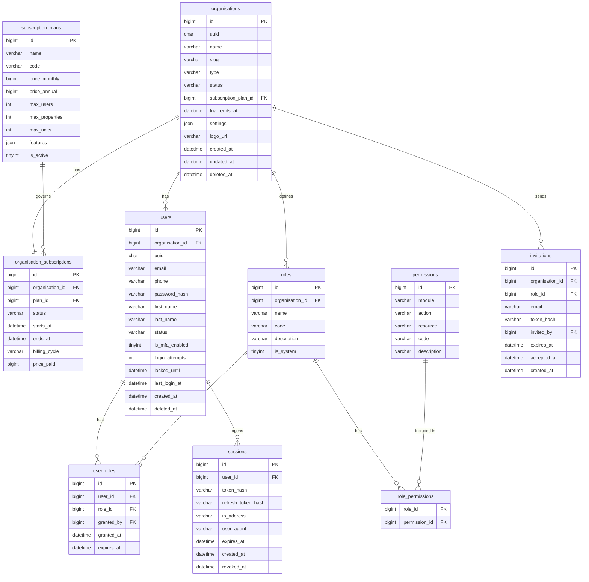
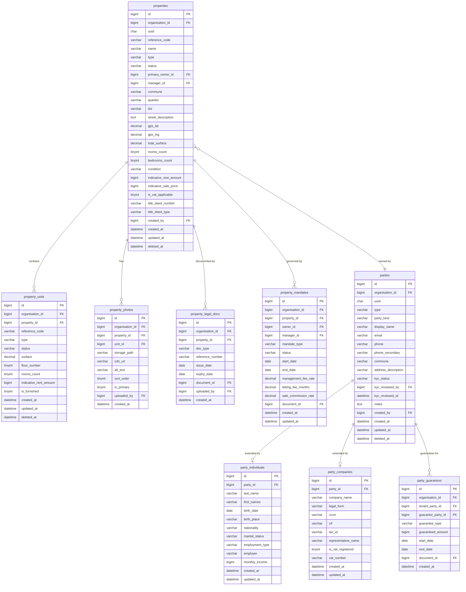
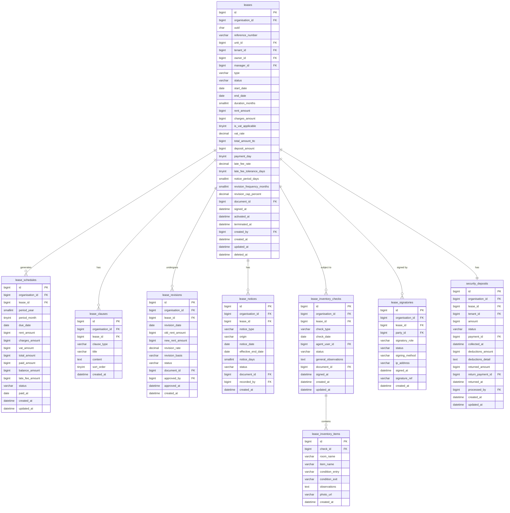
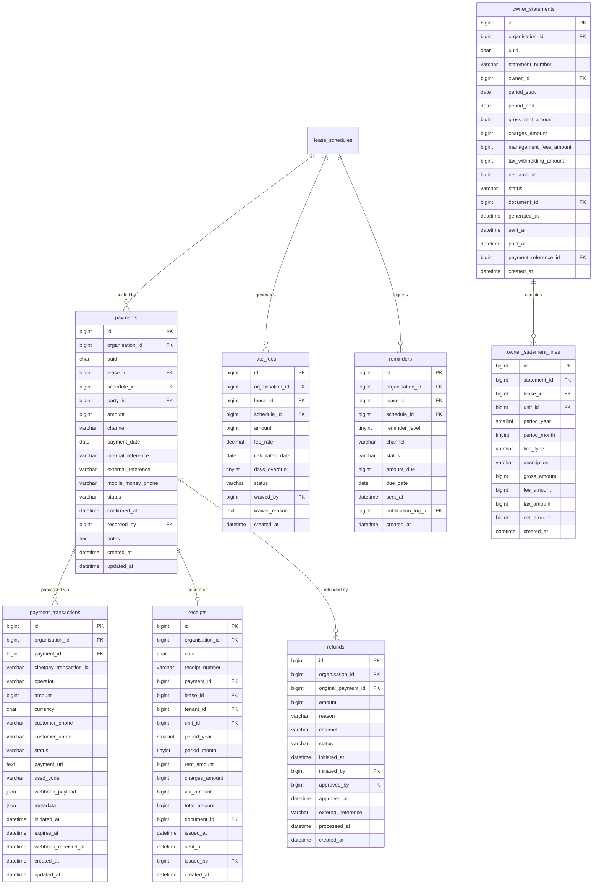
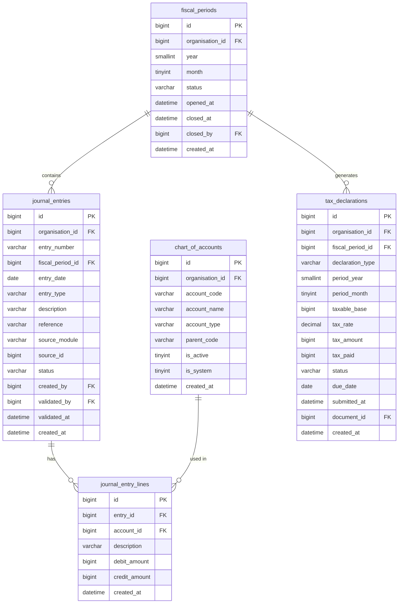
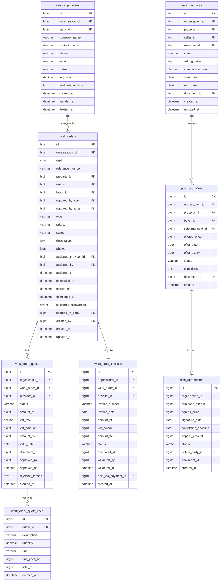
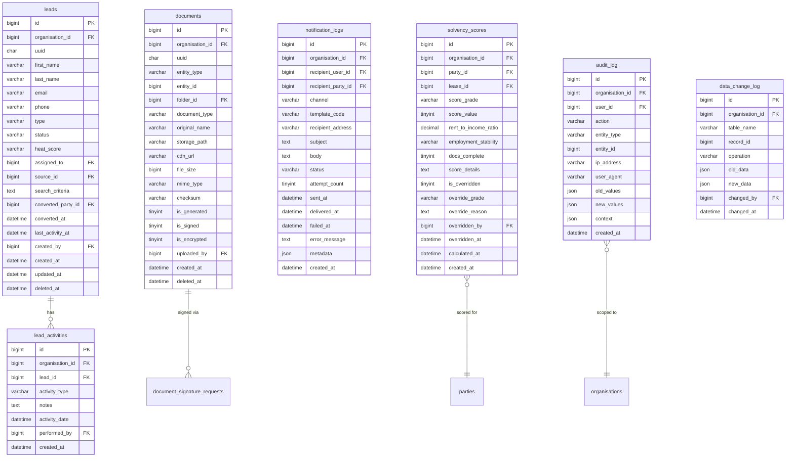

# KILIE IMMO — Conception Base de Données MySQL
## Document de Référence DBA — v1.0 — Juin 2026
### Partie 1 : Modèle Conceptuel, Logique & ERD

---

## 1. PRINCIPES DE CONCEPTION

### 1.1 Moteur et Encodage

| Paramètre | Valeur | Justification |
|---|---|---|
| Moteur | InnoDB | ACID, FK, transactions, row-level locking |
| Charset | utf8mb4 | Unicode complet, emojis, noms africains |
| Collation | utf8mb4_unicode_ci | Tri insensible à la casse, caractères français |
| Row format | DYNAMIC | VARCHAR/TEXT hors page, performance |
| Version cible | MySQL 8.0+ | JSON natif, window functions, partitioning avancé |

### 1.2 Multi-tenancy — Stratégie Row-Level Isolation

Toutes les tables opérationnelles portent `organisation_id BIGINT UNSIGNED NOT NULL` en deuxième colonne après `id`. Tous les index composites commencent par `organisation_id`. L'isolation est garantie à deux niveaux :

1. **Application** : Chaque requête injecte `WHERE organisation_id = :current_org`
2. **Base** : Index composites `(organisation_id, ...)` — table scan multi-tenant impossible

### 1.3 Conventions de Nommage

| Objet | Convention | Exemple |
|---|---|---|
| Table | snake_case, pluriel | `lease_schedules` |
| Colonne | snake_case | `due_date`, `created_at` |
| PK | `id` BIGINT UNSIGNED AUTO_INCREMENT | `id` |
| UUID externe | `uuid` CHAR(36) | `uuid` (exposé aux APIs) |
| FK | `{table_sing}_id` BIGINT UNSIGNED | `lease_id`, `organisation_id` |
| PK nommée | `PRIMARY KEY (id)` | — |
| UK | `uk_{table}_{champs}` | `uk_users_org_email` |
| Index | `idx_{table}_{champs}` | `idx_leases_org_status` |
| FK constraint | `fk_{table}_{ref}` | `fk_leases_organisation` |
| Statut | `ENUM(...)` ou `VARCHAR(30)` | `status` |
| Booléen | `TINYINT(1)` | `is_active`, `is_vat_applicable` |
| Montant XOF | `BIGINT UNSIGNED` | `amount`, `rent_amount` |
| Taux | `DECIMAL(5,2)` | `vat_rate`, `late_fee_rate` |
| Timestamps | `DATETIME` (UTC) | `created_at`, `updated_at`, `deleted_at` |
| Suppression | Soft delete `deleted_at` | — |

### 1.4 Types de données clés

| Donnée | Type MySQL | Raison |
|---|---|---|
| Montant XOF | `BIGINT UNSIGNED` | FCFA = entier, pas de décimal, évite les erreurs float |
| Taux (%) | `DECIMAL(5,2)` | Ex : 18.00, 10.50 |
| Surface (m²) | `DECIMAL(10,2)` | Précision décimale nécessaire |
| Latitude GPS | `DECIMAL(10,8)` | Précision ~1mm |
| Longitude GPS | `DECIMAL(11,8)` | Précision ~1mm |
| Téléphone | `VARCHAR(20)` | Format E.164 : +22507XXXXXXXX |
| UUID API | `CHAR(36)` | Format standard UUID v4 |
| JSON libre | `JSON` | MySQL 8.0 natif, validé |
| Durée (jours) | `SMALLINT UNSIGNED` | Max 65535 jours |
| Durée (mois) | `TINYINT UNSIGNED` | Max 255 mois |
| Année | `YEAR` | 1901–2155 |

---

## 2. MODÈLE CONCEPTUEL — ENTITÉS ET ASSOCIATIONS

### 2.1 Domaines et entités principales

```
┌─────────────────────────────────────────────────────────────────────┐
│  DOMAINE IAM          DOMAINE PROPERTY       DOMAINE PARTY          │
│  ─────────────        ─────────────────       ─────────────          │
│  Organisation         Property               Party                  │
│  User                 PropertyUnit           Individual             │
│  Role                 PropertyPhoto          Company                │
│  Session              LegalDocument          KYCDocument            │
│  Invitation           Mandate                IdentityDocument       │
│                                                                      │
│  DOMAINE LEASING      DOMAINE FINANCIAL      DOMAINE ACCOUNTING     │
│  ───────────────       ─────────────────      ──────────────────     │
│  Lease                LeaseSchedule          ChartOfAccount         │
│  Clause               Payment                JournalEntry           │
│  Revision             Transaction            FiscalPeriod           │
│  Notice               Receipt                TaxDeclaration         │
│  InventoryCheck       LateFee                OwnerStatement         │
│  SecurityDeposit      Reminder                                       │
│                                                                      │
│  DOMAINE MAINTENANCE  DOMAINE SALES          DOMAINE CRM            │
│  ─────────────────     ─────────────          ───────────            │
│  WorkOrder            SaleMandate            Lead                   │
│  Quote                PurchaseOffer          LeadActivity           │
│  WorkInvoice          SaleAgreement          Viewing                │
│  ServiceProvider      Deed                                           │
│                                                                      │
│  DOMAINE DOCUMENT     DOMAINE NOTIF          DOMAINE AI             │
│  ──────────────        ─────────────          ──────────             │
│  Document             NotifTemplate          SolvencyScore          │
│  Folder               NotifLog               PropertyValuation      │
│  ShareLink            NotifQueue             PaymentRisk            │
│  SignatureRequest      Preference             OcrExtraction          │
│                                                                      │
│  DOMAINE AUDIT                                                       │
│  ──────────────                                                      │
│  AuditLog                                                            │
│  DataChangeLog                                                       │
└─────────────────────────────────────────────────────────────────────┘
```

### 2.2 Catalogue complet des tables (~100 tables)

| # | Table | Domaine | Enregistrements estimés (5 ans) |
|---|---|---|---|
| 1 | `organisations` | IAM | 5 000 |
| 2 | `users` | IAM | 50 000 |
| 3 | `roles` | IAM | 200 |
| 4 | `user_roles` | IAM | 100 000 |
| 5 | `permissions` | IAM | 500 |
| 6 | `role_permissions` | IAM | 5 000 |
| 7 | `user_permissions` | IAM | 20 000 |
| 8 | `sessions` | IAM | 2 000 000 |
| 9 | `invitations` | IAM | 50 000 |
| 10 | `password_reset_tokens` | IAM | 100 000 |
| 11 | `subscription_plans` | Subscription | 20 |
| 12 | `subscription_plan_features` | Subscription | 200 |
| 13 | `organisation_subscriptions` | Subscription | 5 000 |
| 14 | `subscription_invoices` | Subscription | 60 000 |
| 15 | `properties` | Property | 500 000 |
| 16 | `property_units` | Property | 2 000 000 |
| 17 | `property_photos` | Property | 10 000 000 |
| 18 | `property_legal_docs` | Property | 1 000 000 |
| 19 | `property_mandates` | Property | 500 000 |
| 20 | `property_status_history` | Property | 2 000 000 |
| 21 | `property_amenities` | Property | 5 000 000 |
| 22 | `parties` | Party | 2 000 000 |
| 23 | `party_individuals` | Party | 1 500 000 |
| 24 | `party_companies` | Party | 500 000 |
| 25 | `party_identity_docs` | Party | 3 000 000 |
| 26 | `party_kyc_docs` | Party | 5 000 000 |
| 27 | `party_guarantors` | Party | 500 000 |
| 28 | `leases` | Leasing | 1 000 000 |
| 29 | `lease_schedules` | Leasing | 30 000 000 |
| 30 | `lease_clauses` | Leasing | 5 000 000 |
| 31 | `lease_revisions` | Leasing | 2 000 000 |
| 32 | `lease_renewals` | Leasing | 500 000 |
| 33 | `lease_notices` | Leasing | 1 000 000 |
| 34 | `lease_inventory_checks` | Leasing | 2 000 000 |
| 35 | `lease_inventory_items` | Leasing | 40 000 000 |
| 36 | `lease_signatories` | Leasing | 3 000 000 |
| 37 | `security_deposits` | Leasing | 1 000 000 |
| 38 | `payments` | Financial | 30 000 000 |
| 39 | `payment_transactions` | Financial | 25 000 000 |
| 40 | `receipts` | Financial | 25 000 000 |
| 41 | `late_fees` | Financial | 5 000 000 |
| 42 | `reminders` | Financial | 20 000 000 |
| 43 | `owner_statements` | Financial | 5 000 000 |
| 44 | `owner_statement_lines` | Financial | 30 000 000 |
| 45 | `refunds` | Financial | 500 000 |
| 46 | `chart_of_accounts` | Accounting | 10 000 |
| 47 | `journal_entries` | Accounting | 60 000 000 |
| 48 | `journal_entry_lines` | Accounting | 120 000 000 |
| 49 | `fiscal_periods` | Accounting | 60 000 |
| 50 | `tax_declarations` | Accounting | 300 000 |
| 51 | `tax_declaration_lines` | Accounting | 1 500 000 |
| 52 | `service_providers` | Maintenance | 200 000 |
| 53 | `service_provider_specialties` | Maintenance | 500 000 |
| 54 | `work_orders` | Maintenance | 5 000 000 |
| 55 | `work_order_quotes` | Maintenance | 4 000 000 |
| 56 | `work_order_quote_lines` | Maintenance | 20 000 000 |
| 57 | `work_order_invoices` | Maintenance | 4 000 000 |
| 58 | `work_order_status_history` | Maintenance | 20 000 000 |
| 59 | `sale_mandates` | Sales | 200 000 |
| 60 | `sale_viewings` | Sales | 1 000 000 |
| 61 | `purchase_offers` | Sales | 500 000 |
| 62 | `sale_agreements` | Sales | 200 000 |
| 63 | `sale_deeds` | Sales | 100 000 |
| 64 | `sale_commissions` | Sales | 200 000 |
| 65 | `leads` | CRM | 2 000 000 |
| 66 | `lead_interests` | CRM | 5 000 000 |
| 67 | `lead_activities` | CRM | 10 000 000 |
| 68 | `lead_viewings` | CRM | 2 000 000 |
| 69 | `lead_sources` | CRM | 100 |
| 70 | `condominiums` | Condominium | 50 000 |
| 71 | `condominium_lots` | Condominium | 500 000 |
| 72 | `condominium_budgets` | Condominium | 200 000 |
| 73 | `condominium_charges` | Condominium | 1 000 000 |
| 74 | `condominium_charge_lots` | Condominium | 10 000 000 |
| 75 | `general_meetings` | Condominium | 100 000 |
| 76 | `general_meeting_resolutions` | Condominium | 500 000 |
| 77 | `documents` | Document | 50 000 000 |
| 78 | `document_folders` | Document | 5 000 000 |
| 79 | `document_shares` | Document | 2 000 000 |
| 80 | `document_signature_requests` | Document | 3 000 000 |
| 81 | `document_signatories` | Document | 6 000 000 |
| 82 | `document_templates` | Document | 1 000 |
| 83 | `notification_templates` | Notification | 500 |
| 84 | `notification_logs` | Notification | 200 000 000 |
| 85 | `notification_preferences` | Notification | 1 000 000 |
| 86 | `notification_queue` | Notification | 1 000 000 (actifs) |
| 87 | `solvency_scores` | AI | 5 000 000 |
| 88 | `property_valuations` | AI | 2 000 000 |
| 89 | `payment_risk_assessments` | AI | 20 000 000 |
| 90 | `ocr_extractions` | AI | 10 000 000 |
| 91 | `ai_decision_overrides` | AI | 500 000 |
| 92 | `audit_auth_logs` | Audit | 100 000 000 |
| 93 | `audit_log` | Audit | 500 000 000 |
| 94 | `data_change_log` | Audit | 200 000 000 |
| 95 | `system_events` | Audit | 50 000 000 |
| 96 | `archive_jobs` | Archive | 10 000 |
| 97 | `archived_leases` | Archive | 5 000 000 |
| 98 | `archived_payments` | Archive | 100 000 000 |
| 99 | `archived_journal_entries` | Archive | 300 000 000 |
| 100 | `schema_migrations` | System | 1 000 |

---

## 3. DIAGRAMMES ERD — PAR DOMAINE

### ERD 1 — IAM & Subscriptions



### ERD 2 — Properties & Parties



### ERD 3 — Leasing & Contrats



### ERD 4 — Finance & Paiements



### ERD 5 — Comptabilité



### ERD 6 — Maintenance & Sales



### ERD 7 — CRM, Documents, Notifications, IA & Audit



---

## 4. MODÈLE LOGIQUE — RELATIONS INTER-DOMAINES

### 4.1 Table de jointure des relations principales

| Entité Source | Cardinalité | Entité Cible | Clé de jointure | Contrainte |
|---|---|---|---|---|
| `organisations` | 1 → N | `users` | `users.organisation_id` | CASCADE DELETE impossible — désactiver uniquement |
| `organisations` | 1 → 1 | `organisation_subscriptions` | `organisation_subscriptions.organisation_id` | |
| `properties` | 1 → N | `property_units` | `property_units.property_id` | CASCADE DELETE si brouillon seulement |
| `property_units` | 1 → N | `leases` | `leases.unit_id` | RESTRICT — unité avec bail actif |
| `parties` | 1 → N | `leases` (tenant) | `leases.tenant_id` | RESTRICT |
| `parties` | 1 → N | `leases` (owner) | `leases.owner_id` | RESTRICT |
| `leases` | 1 → N | `lease_schedules` | `lease_schedules.lease_id` | CASCADE DELETE si BROUILLON |
| `lease_schedules` | 1 → N | `payments` | `payments.schedule_id` | RESTRICT |
| `payments` | 1 → N | `payment_transactions` | `payment_transactions.payment_id` | CASCADE |
| `payments` | 1 → 1 | `receipts` | `receipts.payment_id` | RESTRICT |
| `leases` | 1 → 1 | `security_deposits` | `security_deposits.lease_id` | |
| `work_orders` | 1 → N | `work_order_quotes` | `work_order_quotes.work_order_id` | |
| `documents` | N → 1 | toutes entités | `entity_type + entity_id` | Polymorphique |

### 4.2 Associations polymorphiques

Trois tables utilisent une relation polymorphique via `(entity_type, entity_id)` :

| Table | Entités référencées |
|---|---|
| `documents` | `lease`, `property`, `party`, `work_order`, `sale_agreement`, `receipt`, `owner_statement` |
| `audit_log` | Toutes les entités |
| `data_change_log` | Toutes les tables |

---

*Partie 2 : Modèle Physique complet → voir DATABASE_DESIGN_P2.md*
